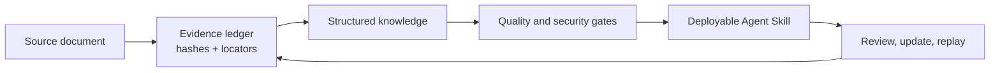

# Evidence-first Book2Skill

Compile books and documents into traceable, reviewable and deployable AI Skills — with source evidence instead of unverifiable summaries.

> 中文文档：[README.zh-CN.md](README.zh-CN.md) · Package/CLI name: `book2skill`

[](https://github.com/lajark/evidence-first-book-to-skill-compiler/actions/workflows/ci.yml)
[](https://www.python.org/downloads/)
[](LICENSE)

## Why

Turning a document into a short summary is easy. Showing where each useful claim came from, whether it can be reviewed, and how it changes when the source changes is harder. Book2Skill is a local-first compiler for that evidence boundary.



## What makes it different

| Ordinary document-to-Skill pipeline | Evidence-first Book2Skill |
|---|---|
| Summary-first compression | Evidence-first compilation |
| Claims are hard to trace | Stable source IDs, block locators and provenance |
| Black-box output | Reviewable AnalysisBundle, IR and reports |
| Rebuilds lose context | Deterministic replay and incremental updates |
| Accuracy is asserted | Quality, security and content-integrity gates |

The four design promises are **Traceable · Reviewable · Reproducible · Updateable**.
The [traceability matrix](TRACEABILITY_MATRIX.md), [quality gates](docs/QUALITY_GATES.md),
and [public Benchmark](docs/BENCHMARK.md) define the evidence and boundaries behind
those claims.

## 3-minute demo

The public demo uses an original repository-authored note and the offline Mock LLM. It does not upload source text:

```bash
python scripts/build_public_demo.py --output-dir .workspace/tmp/public-demo --json
```

Open the generated `skill/SKILL.md`, `skill/provenance.yml`, `skill/quality-report.md`, and `skill/content-integrity.json`. The script also verifies the final artifact and prints the source/block locator chain.

See [the demo guide](examples/evidence-first-demo/README.md) and [the Benchmark contract](docs/BENCHMARK.md) for reproducible evidence and limitations.

## Outputs

Each generated Skill normally includes the executable `SKILL.md`, source-linked references,
a provenance manifest, [quality and compatibility reports](docs/QUALITY_GATES.md), a
normalized replay boundary, and content-integrity evidence. The compiler never bypasses
DRM or publishes a user's copyrighted source by default; see the [distribution policy](DISTRIBUTION_POLICY.md)
for the release boundary.

## Upstream and architecture context

This project references and selectively ports parts of [virgiliojr94/book-to-skill](https://github.com/virgiliojr94/book-to-skill). Licenses, ported files, and commit records are documented in [THIRD_PARTY_NOTICES.md](THIRD_PARTY_NOTICES.md) and [docs/PROVENANCE.yml](docs/PROVENANCE.yml). The upstream project focuses on turning books or document collections into on-demand Agent Skills with deterministic extractors, chapter files, and multi-host usage.

Book2Skill extends that foundation with a stronger lifecycle and audit boundary:

| Area | Upstream `book-to-skill` | Book2Skill |
|---|---|---|
| Product goal | Quickly create a usable book/document Skill | Maintainable, reviewable, publishable knowledge compilation |
| Source traceability | Extracted content and generated chapter/Skill files | Immutable Raw, SHA-256, `source_id + block_id`, locators, provenance replay |
| Intermediate artifacts | Primarily generated Skill files | Versioned `AnalysisBundle`, schemas, IR, Wiki, and diffs |
| Updates | Update/fold-in workflows | Add-only by default, explicit source replacement, conflict detection, journals, rollback, active pointers |
| Quality and security | Skill validation rules | Source coverage, broken links, injection/path checks, quote limits, token budgets, claim and runtime-scaffold warnings |
| LLM runtime | Agent/extractor workflow driven | OpenAI-compatible adapters, profile contracts, data-send policy, routing, caching, streaming metrics, fail-closed behavior |
| Extensibility | Skill/scripts as the main extension surface | Public Extension SDK, manifests, dependency resolution, install/upgrade/rollback, typed registrars |
| Deployment | Primarily Copilot CLI, Amp, and Claude Code | Claude Code, TRAE, Codex/OpenAI, ChatGPT project directories, and generic project directories |
| Distribution | Repository Skill/CLI workflow | Python package, wheel, schemas, SDK, CLI, and auditable release trees |

The distinction is scope, not a quality judgment: upstream is strong at “extract and use”; Book2Skill adds “trace, review, update, publish, and extend.”

## Installation

### Requirements

- Python 3.11+ (3.13 recommended)
- Windows, macOS, or Linux (the new desktop installer in this update is Windows-only)
- `pip` or `uv`
- Optional: Calibre `ebook-convert` for MOBI/AZW; Tesseract for scanned-PDF OCR

For daily Windows use, install the optional local WebGUI:

```powershell
python -m pip install -e ".[desktop-safe]"
book2skill-desktop
```

See [docs/DESKTOP_GUIDE.md](docs/DESKTOP_GUIDE.md) for installation, configuration,
daily use, and host boundaries; see [docs/DESKTOP_WINDOWS.md](docs/DESKTOP_WINDOWS.md)
for installer, security boundary, and build instructions. This update does not ship a
macOS desktop installer.

### Install from source

PowerShell:

```powershell
cd D:\AI\01_Book2Skill
py -3.11 -m venv .venv
.venv\Scripts\Activate.ps1
python -m pip install -U pip
python -m pip install -e ".[pdf,epub,docx,html,ocr,llm,dev]"
book2skill hello
book2skill version
```

macOS/Linux/Git Bash:

```bash
python3 -m venv .venv
source .venv/bin/activate
python -m pip install -U pip
python -m pip install -e ".[pdf,epub,docx,html,ocr,llm,dev]"
book2skill hello
```

With `uv`:

```bash
uv sync --all-extras
uv run book2skill hello
```

### Install a built wheel

```powershell
python -m pip install dist\book2skill-<version>-py3-none-any.whl
book2skill version
```

Install only the extras needed by the input format. Calibre is an external application, not a pip dependency.

## Quick start

The default local Mock LLM does not send document content over the network.

### Analyze

```bash
book2skill analyze input/my-book.pdf --json
```

This produces an `AnalysisBundle` under `output/bundles/` and persists Raw content, hashes, and locators under `output/workspace/`.

### Build a Skill

```bash
book2skill build input/my-book.pdf \
  --name my-book \
  --description "Turn document knowledge into a traceable executable Skill" \
  --use-when "When you need to reason or act from this document"
```

### Build from a reviewed bundle

```bash
book2skill build --from-analysis output/bundles/bundle_my-book.json \
  --name my-book \
  --description "Turn document knowledge into a traceable executable Skill" \
  --use-when "When you need to reason or act from this document"
```

### Validate

```bash
book2skill validate output/skills/my-book
book2skill validate output/skills/my-book --write
book2skill validate output/skills/my-book --json
book2skill compatibility output/skills/my-book --write
```

Validation covers frontmatter, source coverage, copyright quotes, prompt injection and dangerous links, token budget, high-risk claim wording, runtime-scaffold integrity, and evidence boundaries. Compatibility reports keep internal, optional external-validator, and host evidence separate.

To replay or compare deterministic compilation boundaries:

```bash
book2skill normalize output/bundles/bundle_my-book.json -o normalized-bundle.json
book2skill compare-skill-artifacts path/to/v1.0 path/to/v1.0.1 --json
```

### Deploy, update, and roll back

```bash
book2skill install output/skills/my-book --host claude
book2skill install output/skills/my-book --host codex --project-level
book2skill install output/skills/my-book --host project --project-root ./my-project
book2skill install output/skills/my-book --host claude --dry-run --json
book2skill uninstall my-book --host claude

book2skill update --data-home ./output/workspace \
  --collection-id col-xxx --name my-book --use-when "..."
book2skill update --data-home ./output/workspace \
  --collection-id col-xxx --confirm
book2skill update --data-home ./output/workspace --rollback
```

## Optional OpenAI-compatible LLMs

Real-model execution is fail-closed by default. API keys are read only from environment variables, system credentials, or `.env`; API keys are not accepted as command-line arguments. Start with:

```bash
cp .env.example .env
```

For multi-channel routing and audit manifests, use a profile:

```bash
book2skill build input/my-book.epub \
  --name my-book \
  --description "..." \
  --use-when "..." \
  --llm-profiles llm-profiles.example.yaml \
  --llm-strategy balanced \
  --output-dir output/skills/my-book \
  --bundle-dir output/bundles \
  --data-home output/workspace \
  --rights-note "user-licensed"
```

Before a real run, confirm the document rights, provider data policy, profile roles, and request budget. See [docs/LLM_CONFIG.md](docs/LLM_CONFIG.md).

## Inputs and artifacts

```text
input/                              # user-provided documents; do not commit books
output/bundles/                     # AnalysisBundle files
output/skills/<name>/               # final Skill directory
output/workspace/                   # Raw, Schema, cache, and publish state
dist/book2skill-<version>-*.{whl,tar.gz} # Python distribution artifacts
```

A generated Skill normally contains:

```text
SKILL.md                            # main Skill and workflow
references/                         # knowledge units, Wiki, and source routes
provenance.yml                      # source manifest and hashes
quality-report.{md,json}            # validation results
normalized-bundle.json              # replayable, content-addressed boundary
skill-design-review.json            # advisory task/execution-boundary review
skill-fixtures.json                 # trigger and execution regression fixtures
compatibility-report.{md,json}      # layered spec/tool/host evidence
```

## Format support

| Format | Extensions | Dependency |
|---|---|---|
| PDF | `.pdf` | `pymupdf` / `pypdf` / `pdfminer.six` |
| EPUB | `.epub` | `ebooklib` / `beautifulsoup4` |
| DOCX | `.docx` | `python-docx` with ZIP/XML fallback |
| TXT / Markdown | `.txt` / `.md` | Standard library |
| HTML | `.html` / `.htm` | `beautifulsoup4` or standard-library fallback |
| RTF | `.rtf` | Built-in parser |
| MOBI / AZW | `.mobi` / `.azw` / `.azw3` | Calibre CLI |

The project does not bypass DRM, download pirated material, require a specific model or converter, or upload source documents by default.

## Testing and quality

```bash
.venv/Scripts/pytest tests -q
.venv/Scripts/ruff check src/ tests/ scripts/
.venv/Scripts/mypy src/
.venv/Scripts/python scripts/check_provenance.py
.venv/Scripts/python -m hatchling build
```

CI runs the supported Python/OS matrix, tests, lint, type checks, provenance, policy scans, and distribution checks. Optional external-tool or platform cases remain explicitly separated from the core gate.

## Documentation

- [README.zh-CN.md](README.zh-CN.md) — Chinese guide
- [docs/LLM_CONFIG.md](docs/LLM_CONFIG.md) — LLM profiles, data policy, routing
- [ARCHITECTURE.md](ARCHITECTURE.md) — architecture
- [SECURITY.md](SECURITY.md) — security policy
- [SKILL_DEPLOYMENT.md](SKILL_DEPLOYMENT.md) — host deployment
- [EXTENSION_SDK.md](EXTENSION_SDK.md) — Extension SDK
- [THIRD_PARTY_NOTICES.md](THIRD_PARTY_NOTICES.md) — third-party notices
- [docs/PROVENANCE.yml](docs/PROVENANCE.yml) — upstream provenance

## License and rights

The code is MIT-licensed; see [LICENSE](LICENSE). Use only documents you are legally allowed to process. Do not publicly redistribute a Skill derived from a third-party copyrighted book unless you have the required rights. The user is responsible for source-document rights and downstream distribution.
